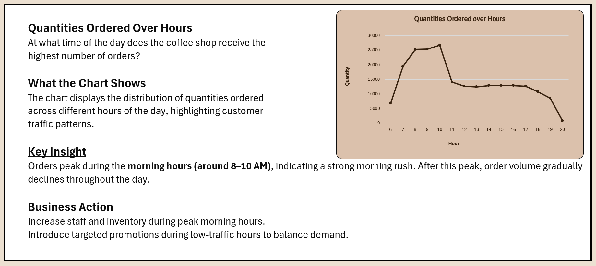
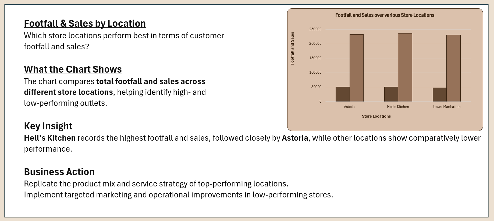
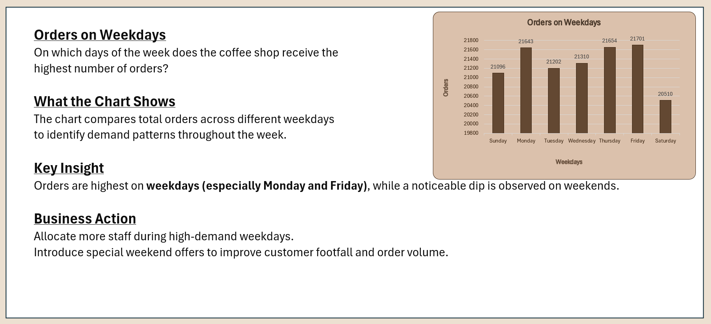
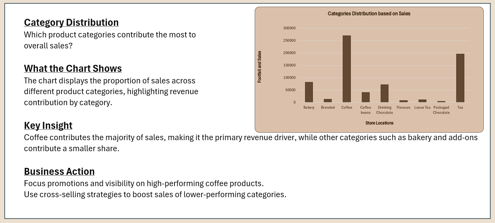
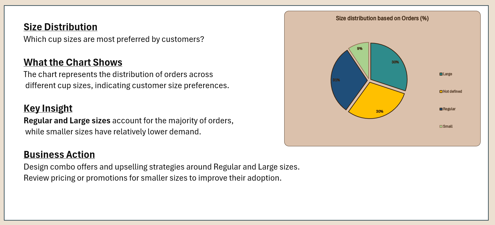
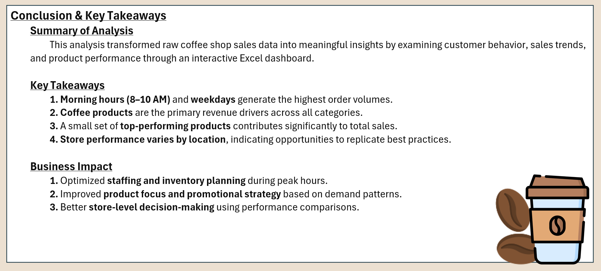

# Coffee Shop Sales Dashboard (Excel)

An interactive Excel dashboard analyzing coffee shop sales, customer behavior, and product performance.

---

## 📌 Project Overview
This project analyzes coffee shop sales data to extract actionable business insights related to:
- Sales performance  
- Customer behavior  
- Order patterns  
- Product demand  

The analysis is presented through an interactive Excel dashboard built using Microsoft Excel.

---

## 📊 Final Dashboard Preview

---

## 📈 Overview & KPI Explanation

**KPIs Included:**
- Total Sales  
- Average Order Value  
- Total Footfall  
- Average Order per Person  

**Insight:**  
These KPIs provide a high-level snapshot of overall business performance and customer purchasing behavior.

---

## ⏰ Quantities Ordered Over Hours

**Insight:**  
Orders peak during the morning hours (8–10 AM), indicating a strong morning rush. Order volume gradually declines as the day progresses.

**Business Action:**  
Increase staffing and inventory during peak morning hours and introduce targeted offers during low-traffic periods.

---

## 📍 Footfall & Sales by Location

**Insight:**  
Hell’s Kitchen records the highest footfall and sales, followed closely by Astoria, while Lower Manhattan shows comparatively lower performance.

**Business Action:**  
Replicate product mix and service strategies from top-performing locations and improve marketing efforts in low-performing stores.

---

## 📅 Orders on Weekdays

**Insight:**  
Orders are highest on weekdays, especially Monday and Friday, with a noticeable dip during weekends.

**Business Action:**  
Allocate more staff during high-demand weekdays and introduce weekend offers to boost footfall.

---

## 🧾 Category Distribution Based on Sales

**Insight:**  
Coffee is the primary revenue driver, contributing the majority of total sales, while other categories play a supporting role.

**Business Action:**  
Focus promotions on high-performing coffee products and apply cross-selling strategies to boost other categories.

---

## ☕ Size Distribution

**Insight:**  
Regular and Large cup sizes account for most orders, while Small sizes have lower demand.

**Business Action:**  
Design upselling strategies around Regular and Large sizes and review pricing or promotions for smaller sizes.

---

## 🏁 Conclusion & Key Takeaways

**Key Takeaways:**
- Morning hours and weekdays generate the highest order volumes.  
- Coffee products are the primary revenue drivers.  
- A small set of top-performing products contributes significantly to total sales.  
- Store performance varies by location, highlighting optimization opportunities.

**Business Impact:**
- Optimized staffing and inventory planning  
- Improved promotional and product focus  
- Better store-level decision-making  

---

## 🛠 Tools Used
- Microsoft Excel  
- Pivot Tables  
- Charts & Slicers  
